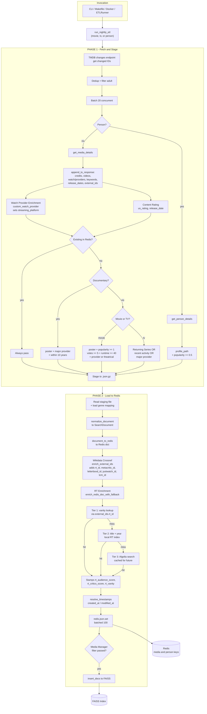

# Nightly ETL Enrichment Pipeline

## Overview

The TMDB nightly ETL is a two-phase pipeline that detects recently changed media items via the TMDB `/changes` API, enriches them with multiple data sources, and upserts the final documents into Redis. An optional third output pushes qualifying documents to Media Manager (FAISS).

The pipeline runs for each media type independently: `movie`, `tv`, and `person`.

---

## Pipeline Diagram

---

## Phase 1 - Fetch and Stage

| Step | Function | Location |
|------|----------|----------|
| Discover changed IDs | `_get_all_change_ids()` | `tmdb_nightly_etl.py` |
| Fetch details (media) | `get_media_details()` | `api/tmdb/core.py` |
| Fetch details (person) | `get_person_details()` | `api/tmdb/person.py` |
| Watch provider enrichment | `custom_watch_provider()` | `api/tmdb/core.py` |
| Content rating | `get_content_rating()` | `api/tmdb/core.py` |
| Documentary detection | `is_documentary()` / `is_eligible_documentary()` | `etl/documentary_filter.py` |
| Media intake filter | `_passes_media_filter()` | `tmdb_nightly_etl.py` |
| Person intake filter | `_passes_person_filter()` | `tmdb_nightly_etl.py` |
| Staging output | gzipped JSON | `tmdb_nightly_etl.py` |

### TMDB append_to_response sub-requests

A single TMDB API call bundles these via `append_to_response`:

- `credits` - cast + crew, top 5 cast, director extraction
- `videos` - trailers, teasers, clips (top 5 each)
- `watch/providers` - US region flatrate / buy / rent
- `keywords` - keyword list + count
- `release_dates` (movie) - US theatrical type 2/3 detection, us_rating
- `content_ratings` (TV) - us_rating
- `external_ids` - imdb_id, tvdb_id, facebook_id, instagram_id, twitter_id, wikidata_id

### Intake filter rules

**Movies** require all of: poster, popularity >= 1.0, vote_count >= 5, runtime >= 40 min, AND one of: major streaming provider, US theatrical release (type 2/3), or "In Theaters".

**TV** passes if any of: Returning Series, last_air_date >= 2023-01-01, or has major provider availability.

**Documentaries** are filtered separately: must be documentary genre, have poster, be on a major streaming provider, and released within the last 10 years. If the documentary criteria fail, the item is rejected (does not fall through to the standard filter).

**Persons** require: profile_path + popularity >= 0.5.

**Existing items** (already in Redis) always pass -- they must be updated regardless of filter criteria.

---

## Phase 2 - Load to Redis

| Step | Function | Location |
|------|----------|----------|
| Normalize to SearchDocument | `normalize_document()` | `core/normalize.py` |
| Convert to Redis dict | `document_to_redis()` | `core/normalize.py` |
| Wikidata crossref enrichment | `enrich_external_ids()` | `core/wikidata_crossref.py` |
| RT enrichment (with Algolia fallback) | `enrich_redis_doc_with_fallback()` | `etl/rt_enrichment.py` |
| Timestamp resolution | `resolve_timestamps()` | `core/normalize.py` |
| Redis upsert | `redis.json().set(key, "$", doc)` batched 100 | `tmdb_nightly_etl.py` |
| Media Manager push | `passes_media_manager_filter()` | `etl/media_manager_filter.py` |

### Enrichment layers applied during Phase 2

1. **Wikidata crossref** - `enrich_external_ids()` merges identifiers from `data/wikidata_tmdb_tms_crossref.json` into `external_ids`. Adds `rt_id`, `metacritic_id`, `letterboxd_id`, `justwatch_id`, `tcm_id` where the crossref has data and TMDB did not provide them. Never overwrites existing keys.

2. **Rotten Tomatoes** - `enrich_redis_doc_with_fallback()` runs the full 3-tier strategy. Tier 1 vanity lookup via `external_ids.rt_id`, tier 2 title+year match against `data/rt/content_index.json`, and tier 3 Algolia live search if local tiers miss. Algolia results are cached into the local index for future runs. Stamps `rt_audience_score`, `rt_critics_score`, `rt_vanity`, `rt_release_year`, `rt_runtime` and back-populates `external_ids.rt_id` and `external_ids.tms_id`.

3. **Timestamp resolution** - `resolve_timestamps()` reads the existing Redis document to preserve `created_at` for updates. New documents get `created_at = now`. All documents get `modified_at = now` and `_source = "nightly_etl"`.

---

## Data Sources

| Source | Data File / API | What It Provides |
|--------|-----------------|------------------|
| TMDB Changes API | `/{type}/changes` | IDs of recently changed items |
| TMDB Details API | `/{type}/{id}` + `append_to_response` | Core metadata, credits, videos, providers, keywords, ratings, external IDs |
| Wikidata crossref | `data/wikidata_tmdb_tms_crossref.json` (~3M entries) | rt_id, metacritic_id, letterboxd_id, justwatch_id, tcm_id |
| RT content index | `data/rt/content_index.json` (~3.5M lines) | RT scores, vanity, release year, runtime, tms_id |
| TMDB genre mapping | Fetched at runtime or local fallback | Genre ID to name resolution |

---

## Key Files

| File | Role |
|------|------|
| `src/etl/tmdb_nightly_etl.py` | Main two-phase ETL orchestrator |
| `src/api/tmdb/core.py` | TMDB API: `get_media_details()`, `custom_watch_provider()`, `get_content_rating()` |
| `src/api/tmdb/person.py` | TMDB API: `get_person_details()` |
| `src/core/normalize.py` | `normalize_document()`, `document_to_redis()`, `resolve_timestamps()` |
| `src/core/wikidata_crossref.py` | `enrich_external_ids()` - Wikidata crossref merge |
| `src/etl/rt_enrichment.py` | `enrich_redis_doc_with_fallback()` - RT enrichment with Algolia fallback |
| `src/api/rottentomatoes/local_store.py` | `RTContentLookupStore` - in-memory RT index |
| `src/etl/documentary_filter.py` | `is_documentary()`, `is_eligible_documentary()` |
| `src/etl/media_manager_filter.py` | `passes_media_manager_filter()` - FAISS push gate |
| `src/core/streaming_providers.py` | `MAJOR_STREAMING_PROVIDERS`, `TV_SHOW_CUTOFF_DATE` |
| `config/etl_jobs.yaml` | Job definitions for ETLRunner |
| `src/etl/etl_runner.py` | Loads job config, manages job start dates |
